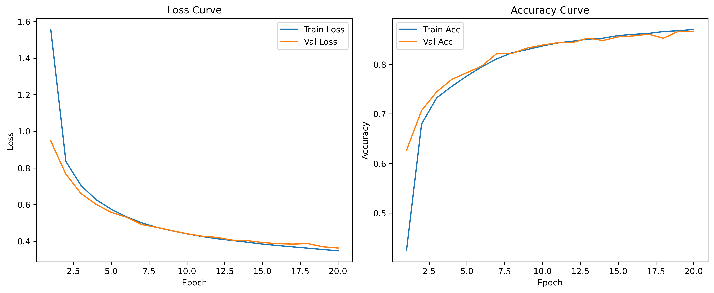

# CNN Models on FashionMNIST (LeNet-5 & AlexNet)

## Overview
This project implements and compares classic convolutional neural networks (CNNs) on the FashionMNIST dataset using PyTorch.

We start with LeNet-5 as a baseline model and extend to AlexNet to study the impact of deeper architectures and activation functions on performance.

---

## Models

### 1. LeNet-5
- Input: 28×28 grayscale images
- Architecture: 2 convolutional layers + 3 fully connected layers
- Activation: Sigmoid
- Pooling: Average Pooling

### 2. AlexNet
- Input: 227×227 grayscale images (resized)
- Architecture: deeper CNN with 5 convolutional layers and 3 fully connected layers
- Activation: ReLU
- Pooling: Max Pooling
- Regularization: Dropout

---

## Training

- Dataset: FashionMNIST
- Optimizer: Adam
- Loss Function: CrossEntropyLoss
- Train/Validation split: 80% / 20%

### LeNet-5
- Epochs: 20
- Batch size: 128
- Best validation accuracy: ~86%

### AlexNet
- Epochs: 10
- Batch size: 64
- Best validation accuracy: ~93%

---

## Results

### Performance Comparison

| Model   | Validation Accuracy |
|--------|--------------------|
| LeNet-5 | ~86% |
| AlexNet | ~93% |

### Key Observations

- AlexNet significantly outperforms LeNet-5 (+7% accuracy)
- Deeper architecture improves feature extraction capability
- ReLU activation leads to faster convergence compared to Sigmoid
- No obvious overfitting observed (train and validation curves are close)

---

## Visualization

The training process is visualized with:
- Loss curves (train vs validation)
- Accuracy curves (train vs validation)

Example:

---

## Test & Inference

- Models are evaluated on the test set after training
- Predictions are visualized with:
  - True label (T)
  - Predicted label (P)
  - Color-coded correctness (green/red)

---

## Project Structure
CNN_learning/
├── models/
│   ├── lenet_5.py
│   └── alexnet.py
├── train/
│   ├── train_lenet_5.py
│   ├── train_alexnet.py
│   ├── test_lenet_5.py
│   └── test_alexnet.py
├── utils/
│   └── visualize_data.py
├── data/
├── results/
└── README.md

---

## Output

### LeNet-5
- `lenet_fashionmnist_best.pth`
- `lenet_fashionmnist_curves.png`

### AlexNet
- `alexnet_fashionmnist_best.pth`
- `alexnet_fashionmnist_curves.png`

---

## Conclusion

This project demonstrates how increasing model depth and using modern activation functions (ReLU) can significantly improve performance on image classification tasks.

The comparison between LeNet-5 and AlexNet highlights the evolution of CNN architectures and their impact on representation learning.

---

## Future Work

- Implement ResNet for further comparison
- Experiment with different hyperparameters (learning rate, batch size)
- Analyze misclassified samples